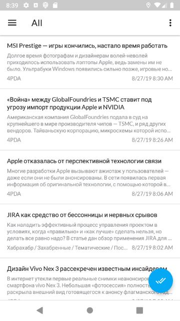
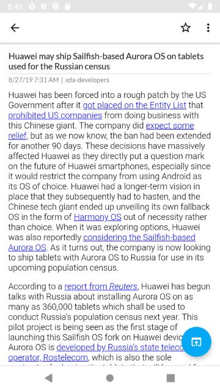

Old Owl
=======

Unofficial RSS client for The Old Reader

### Features

* Offline reading
* Search RSS feeds for keywords
* Ability to share an article
* Auto update feeds
* Auto cleanup read/unread articles

### Screenshots

